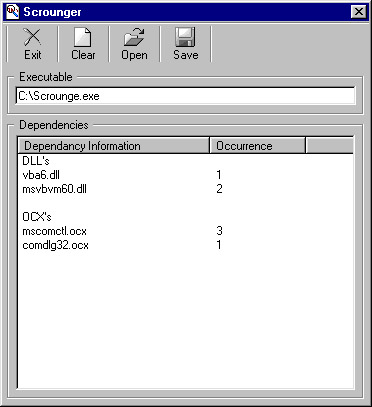



## Scrounge

### Description

Extracts all dependency information (.dll's and .ocx's) from an executable, and returns the information in a listbox. Also has the option of saving the information to a comma-delimited file.
 
### More Info
 

             |
---                |---
**Submitted On**   |2001-02-17 15:30:24
**By**             |[Andreas Laubscher](https://github.com/Planet-Source-Code/PSCIndex/blob/master/ByAuthor/andreas-laubscher.md)
**Level**          |Intermediate
**User Rating**    |4.9 (39 globes from 8 users)
**Compatibility**  |VB 6\.0
**Category**       |[Files/ File Controls/ Input/ Output](https://github.com/Planet-Source-Code/PSCIndex/blob/master/ByCategory/files-file-controls-input-output__1-3.md)
**World**          |[Visual Basic](https://github.com/Planet-Source-Code/PSCIndex/blob/master/ByWorld/visual-basic.md)
**Archive File**   |[CODE\_UPLOAD151092172001\.zip](https://github.com/Planet-Source-Code/andreas-laubscher-scrounge__1-21094/archive/master.zip)

